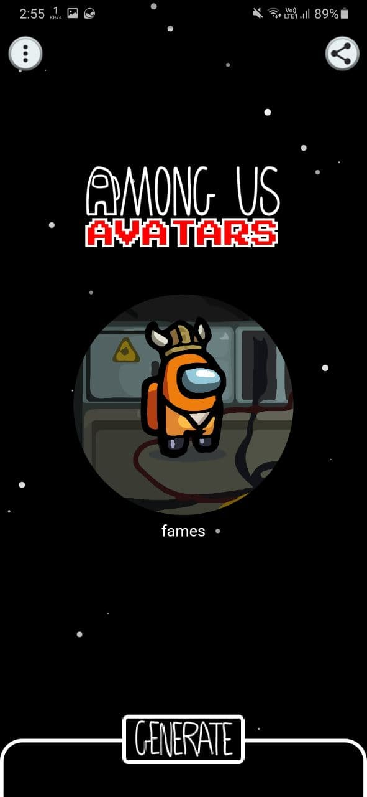
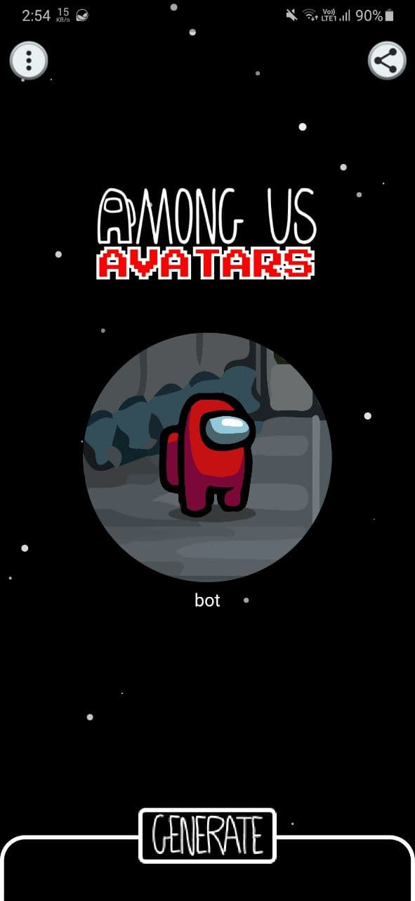
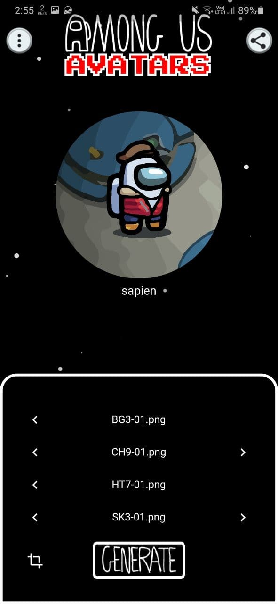
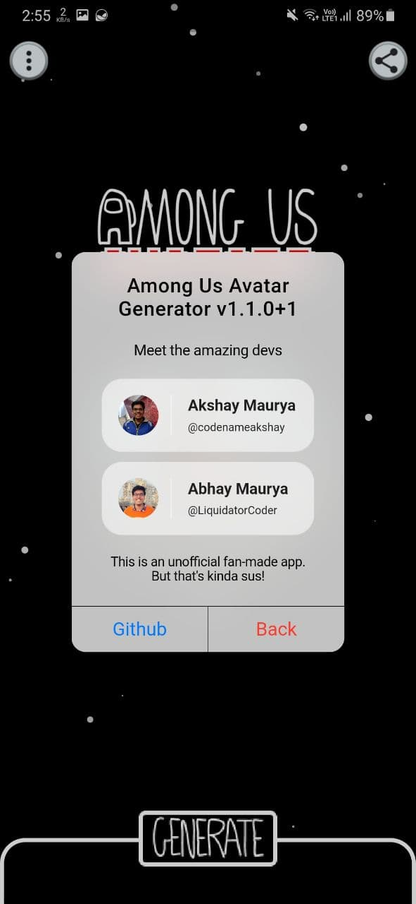

# <div align="center"> Among Us Avatar Generator</div>

<div align="center"><b>AUAG</b> is a simple open-source avatar generator app for Android. It is built with Dart on top of Google's Flutter Framework.


</div>
<!-- <a href=''></a> -->

<b>AUAG</b> brings you a simple tool to create, share your favourite among us avatars, and save them. You can create them randomly, or using the fine tune editor carefully. With features like random name generator and crop, you can create anything that you want!

<b>➡INCLUDES</b>
- 14 characters!
- 7 hats!
- 4 skins!
- 3 backgrounds!
.. and more!

Feel free to contact us for any issues, hash.studios.inc@gmail.com

## List of Contents

1. [Features](#features)
2. [Demo](#demo)
3. [Support](#support)
4. [Dependencies](#dependencies)
5. [Usage](#usage)
6. [Contributing](#contributing)
7. [License](#license)
8. [Contributors](#contributors)

## Features

- Generate High quality avatars from the famous game Among Us!
- Featuring 14 characters
- Has 3 OG backgrounds (Electrical, Cafeteria & Cabin)
- Generates random names for the character avatar
- Change details by using the editor
- Crop in square, rounded rectangle & circle frames!
- Save & share easily with on-tap!
- Avatars saved in the highest possible quality always
- Minimal design with smooth transitions and animations
- Optimized storage using minimal packages
- Application size about 8 MB
## Demo

**Screens**

|  |  |  |  |
| :-------------: | :-------------:  | :-------------:  | :-------------:  |
|     Home     |    Generate Ex   |    Editor     |     About       |


## Support

If you like what we do, and would want to help us continue doing it, consider sponsoring this project.

<a href="https://www.buymeacoffee.com/HashStudios" target="_blank"></a>


<!--  -->

## Dependencies

The following packages are needed for the development of this application.

- `faker: ^1.2.1` for generating random names
- `provider: ^^4.3.2+2` for caching data, and state management
- `screenshot: ^0.2.0` for generating images
- `share: ` for sharing the avatars
- `sliding_up_panel: ^1.0.2` for editor panel
- `url_launcher: ^5.7.2` for launching urls

More details about these can be found in the [`pubspec.yaml`](https://github.com/LiquidatorCoder/among_us_app/tree/master/pubspec.yaml) file.

## Usage

More information about the releases can be found in the [Release](https://github.com/LiquidatorCoder/among_us_app/releases) tab.

## Contributing

First off, thank you for considering contributing to AUAG. It's people like you that make AUAG such a great app.

To start your lovely journey with AUAG, first read the [`contributing guidelines`](https://github.com/LiquidatorCoder/among_us_app/tree/master/CONTRIBUTING.md) and then fork the repo to start contributing!

## License

This app is licensed under the [`BSD 3-Clause License`](https://github.com/LiquidatorCoder/among_us_app/tree/master/LICENSE.txt).
Any Usage of the source code must follow the below license.

```
BSD 3-Clause License

Copyright (c) 2020 Abhay Maurya
All rights reserved.

Redistribution and use in source and binary forms, with or without
modification, are permitted provided that the following conditions are met:

1. Redistributions of source code must retain the above copyright notice, this
   list of conditions and the following disclaimer.

2. Redistributions in binary form must reproduce the above copyright notice,
   this list of conditions and the following disclaimer in the documentation
   and/or other materials provided with the distribution.

3. Neither the name of the copyright holder nor the names of its
   contributors may be used to endorse or promote products derived from
   this software without specific prior written permission.

THIS SOFTWARE IS PROVIDED BY THE COPYRIGHT HOLDERS AND CONTRIBUTORS "AS IS"
AND ANY EXPRESS OR IMPLIED WARRANTIES, INCLUDING, BUT NOT LIMITED TO, THE
IMPLIED WARRANTIES OF MERCHANTABILITY AND FITNESS FOR A PARTICULAR PURPOSE ARE
DISCLAIMED. IN NO EVENT SHALL THE COPYRIGHT HOLDER OR CONTRIBUTORS BE LIABLE
FOR ANY DIRECT, INDIRECT, INCIDENTAL, SPECIAL, EXEMPLARY, OR CONSEQUENTIAL
DAMAGES (INCLUDING, BUT NOT LIMITED TO, PROCUREMENT OF SUBSTITUTE GOODS OR
SERVICES; LOSS OF USE, DATA, OR PROFITS; OR BUSINESS INTERRUPTION) HOWEVER
CAUSED AND ON ANY THEORY OF LIABILITY, WHETHER IN CONTRACT, STRICT LIABILITY,
OR TORT (INCLUDING NEGLIGENCE OR OTHERWISE) ARISING IN ANY WAY OUT OF THE USE
OF THIS SOFTWARE, EVEN IF ADVISED OF THE POSSIBILITY OF SUCH DAMAGE.
```

## Contributors

<a href="https://github.com/LiquidatorCoder/among_us_app/graphs/contributors">
  
</a>

## If you made it here, thanks for your support. You can show more support by forking or starring this repo. See ya!
